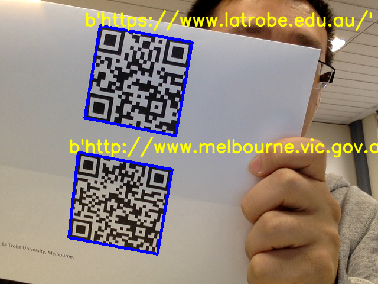

#  Bar and QR code detector


This project is forked from [zbar](https://github.com/NaturalHistoryMuseum/pyzbar) library, I added few modifications, so webcam can be used as an image reader to detect QR and Bar codes.

* Pure python
* Works with PIL / Pillow images, OpenCV / numpy `ndarray`s, and raw bytes
* Decodes locations of barcodes
* No dependencies, other than the zbar library itself
* Tested on Python 2.7, and Python 3.4 to 3.6

Here is a quick look of the final output:

    

## Installation
Mac OS X:
Install [Homebrew](https://brew.sh/):
```bash
/usr/bin/ruby -e "$(curl -fsSL https://raw.githubusercontent.com/Homebrew/install/master/install)"
```
Install `zbar` lib:
```bash
brew install zbar
```

Linux:
```bash
sudo apt-get install libzbar0
```

Install this Python wrapper; use the second form to install dependencies of the command-line scripts:
```bash
pip install pyzbar
pip install pyzbar[scripts]
```

## Jupyter Notebook:
Go to see the Jupyter Notebook for more details.

1. [QR_Bar_Code_Detector_Basic](https://github.com/cuicaihao/Webcam_QR_Detector/blob/master/Lab_01_QR_Bar_Code_Detector_Basic.ipynb)
2. [QR_Bar_Code_Detector_Webcam](https://github.com/cuicaihao/Webcam_QR_Detector/blob/master/Lab_02_QR_Bar_Code_Detector_Webcam.ipynb)


### License
`pyzbar` is distributed under the MIT license (see `LICENCE.txt`).
The `zbar` shared library is distributed under the GNU Lesser General Public
License, version 2.1 (see `zbar-LICENCE.txt`).
